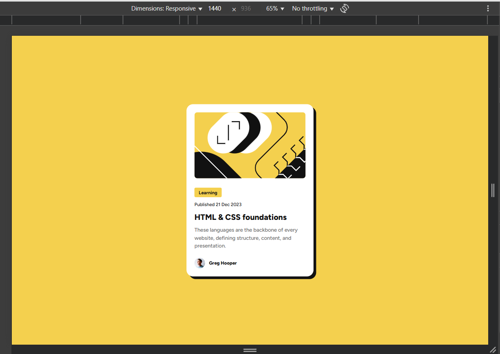
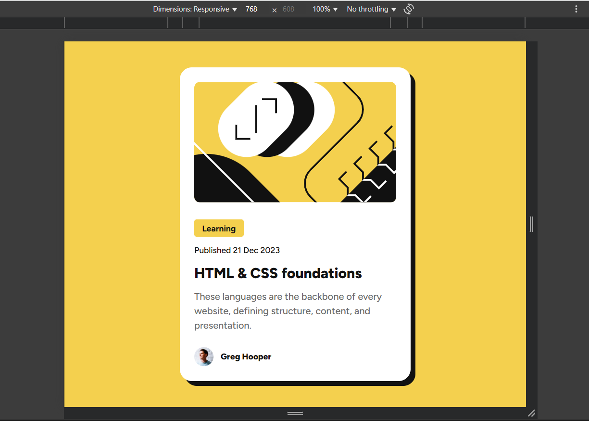
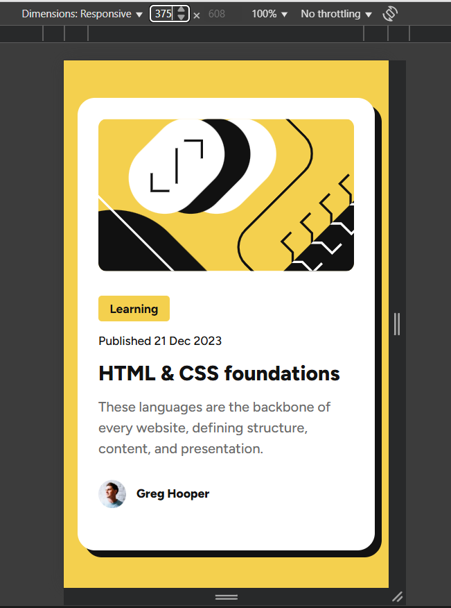

# Frontend Mentor - Blog preview card

## Welcome! 👋

Thanks for checking out this front-end coding challenge.

This is a solution to the [Blog preview card challenge on Frontend Mentor](https://www.frontendmentor.io/challenges/blog-preview-card-ckPaj01IcS). Frontend Mentor challenges help you improve your coding skills by building realistic projects. 

## Table of contents

- [Overview](#overview)
  - [The challenge](#the-challenge)
  - [Screenshot](#screenshot)
  - [Links](#links)
- [My process](#my-process)
  - [Built with](#built-with)
  - [What I learned](#what-i-learned)
  - [Continued development](#continued-development)
  - [Useful resources](#useful-resources)
- [Author](#author)
- [Acknowledgments](#acknowledgments)

## Overview

### The challenge

In this challenge, I learned how to create a design that is responsive for web, tablet, and mobile.

### Screenshot

### Links

- Solution URL: [Git Blog Preview Card By Me](https://github.com/irsalinalayalia/fe_mentor_blog_preview_card)
- Live Site URL: [Blog Preview Card Web](https://irsalinalayalia.github.io/fe_mentor_blog_preview_card/)

## My process

### Built with

- Semantic HTML5 markup
- CSS custom properties
- Flexbox
- Mobile-first workflow

### What I learned

what I learned in this development is how to use CSS custom properties to make the design responsive and how to use flexbox to make the layout responsive.

## Author

- Website - [Irsalina Layalia Shabrina](https://irsalinalayalia.vercel.app/)
- Frontend Mentor - [@irsalinalayalia](https://www.frontendmentor.io/profile/irsalinalayalia)

## Acknowledgments

Thanks to God who always help and accompanied me when working on this project
